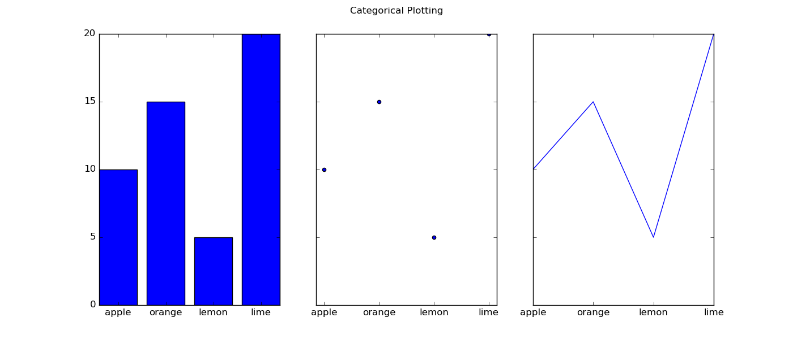

# Jupyter Notebooks

## Overview

This repository contains the following two jupyter notebooks as part of my project for 'Fundamental of Data Analysis' module:

1. `pyplot.ipynb` contains an overview of the matplotlib pyplot package in python and an in-depth explanation of three plots.

2. `cao.ipynb` explains how to load the CAO points information from the official website into data frames using pandas and then compares the CAO points from 2019, 2020 and 2021.

 

## Quick Steps

### Install

1. Download and install [Anaconda]().
2. Download and install [cmder]() if on windows.

 

### How to run:

1. Open [cmder] terminal.
2. Select repository `fundamentals`.
3. Run `jupyter lab` or `jupyter notebook`on the command line.
4. The notebook should automatically launch in your browser. 
5. If not, then you may need to temporarily disable security software as some internet security can interfere with jupyter. 
6. Once jupyter is open in your browser select either notebook: `pyplot.ipynb` or `cao.ipynb` 
7. In the selected notebook click on `kernal` on the tool bar and then `restart and run all`. 

 

### Requirements text file:
`requirements.txt` contains a list of all the python packages requried to import in order to run these notebooks. 

 

## Explore

### Pyplot Notebook

### The Matplotlib Pyplot Package
Matplotlib pyplot is a state based interface used for data visualisation. It is a convenient way for users to generate high quality plots with minimal effort. Pyplot can define and store the current state using various commands and functions. This package has 137 functions that can be used for plotting. In order to demonstrate how pyplot works this notebook explains for following plots in detail. 

### Horizontal Bar Plot
This function takes data and plots it using horizontal bars. It has 5 parameters; y, width, height, left, align. The example in the notebook uses numpy random to generate data for y values and for the width values. Then other pyplot functions are used for example:
- yticks sets the ticks and labels on each of the horizontal bars.
- gca is used to invert the y-axis so that the place names match with the data generated for those cities.
- xlabel is used to put a label on the x-axis
- title adds a title to the plot
- show is used to call and display the horizontal bar plot.
- savefig is used to save the figure as a png file. 

 

 

### Scatter Plot
This function contains the following parameters; x, y, s, c, marker, cmap, norm, vmin, vmax, alpha, linewidths, edgecolors, plotnonfinite. This scatter plot uses the numpy random function again to generate values for x and y. It also generates random color values while also producing random sizes for the markers. As shown here, there are various sizes and colors used in this plot while alpha allows for slight transparency. Along with the scatter plot, these two other pyplot functions are used:
- show is used to call and dsplay the scatter plot.
savefig is used in order to save this figure as a png file. 

 

 

### Histogram
Histograms uses these parameters; x, bins, range, density, weights, cumulative, bottom, histtype, align, orientation, rwidth, log, color, label, stacked. The histogram created in this notebook displays 10000 random values of mean and standard deviation in normal distribution. In other words, various mu and sigma values are passed into the argument as x and are plotted in a bell shaped curve. Other pyplot functions are used here for example:
- xlabel sets the mu value label on the x-axis.
- ylabel describes the sigma values on the y-axis.
- title gives a title of the overall plot. 
- text allows the user to add a text line on the plot at particulat coordinates. 
- xlim sets the limits on the x-axis from left to right.
- ylim sets the limits on the y-axis from bottom to top.
- grid displays the plot on a grid.
- show is used to call and display the histogram. 
- savefig is also used here to create a png for this figure. 

 

 

### Subplots
This function allows users to create one single figure with a set of subplots. It's parameters are; nrows, ncols, sharex, sharey, squeeze, subplot_kw, gridspec_kw, fig_kw. The subplot in this notebook sets one row with three columns. The sharex parameter is set to true which allows the data to be shares on all axes. Then the axs and fig functions are used to call a bar plot at position 0, a scatter plot at position 1 and the plot function plots a y versus x line. These three subplots are displayed in a row with a figure subtitle as seen below. 

 

 

### 2. CAO Notebook
Cao info here....

 

## Credits

#### EXAMPLE
I heavely relied on the EXAMPLE  when creating this repository. You can find it on 

 

## Badges

### NB viewer
[Nbviewer](https://nbviewer.org/) is an online tool created by the Jupyter community for rendering notebooks in static form.

You can view both notebooks on nbviewer by clicking on the following badge:

### Binder
Mybinder is an online service where you can share a notebook in a dynamic and interactive way.

You can view these notebooks on mybinder by clicking on the following badge:

 

## Contact
If you have any queries or if you would like to contribute to this repository please contact me on the below link:

[Sarah McNelis](G00398343@gmit.ie)

 

## Tests
Maybe some troubleshooting problems here?? Errors?? Add later.....

 

## Conclusion
This readme contains a quick overview of two notebooks. 

What would I do with this project in the future???

 

## References

All references and code used in these notebooks have been sourced in Oct/Nov/Dec 2021 and cited in each notebook. 

 

# End